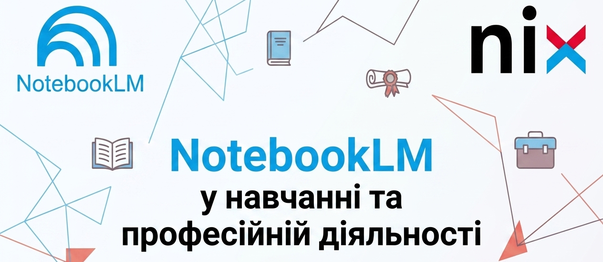

= Опанування NotebookLM

Перед виконанням практичного завдання *рекомендуємо ознайомитися з презентацією, теоретичними матеріалами та додатковими джерелами*, наведеними наприкінці теоретичного блоку. 

Це допоможе вам краще зорієнтуватися у можливостях платформи NotebookLM та ефективніше виконати практичні завдання.

Бажаємо натхнення в навчанні, продуктивної роботи з новими інструментами та вагомих успіхів у вашій професійній діяльності!

== Навчальні матеріали 

====

:linkattrs:

ifdef::env-name[:relfilesuffix: .adoc]

* xref:NotebookLM_Knowledge_Prism.pdf[NotebookLM Презентація, window="_blank"]
* xref:теорія-NotebookLM.html[NotebookLM Теорія, window="_blank"]
* xref:NotebookLM-практикум.html[NotebookLM Практика, window="_blank"]

====

image::images/footer.png[Under, width=100%]